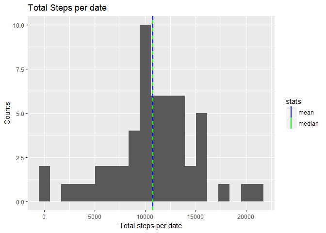
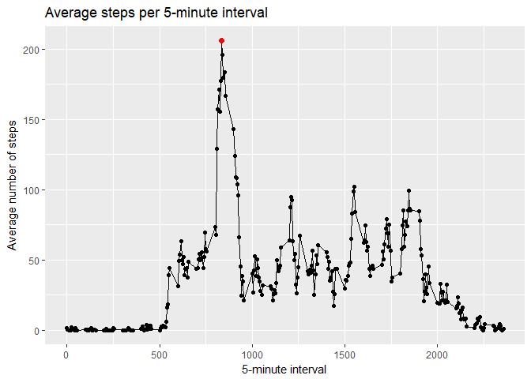
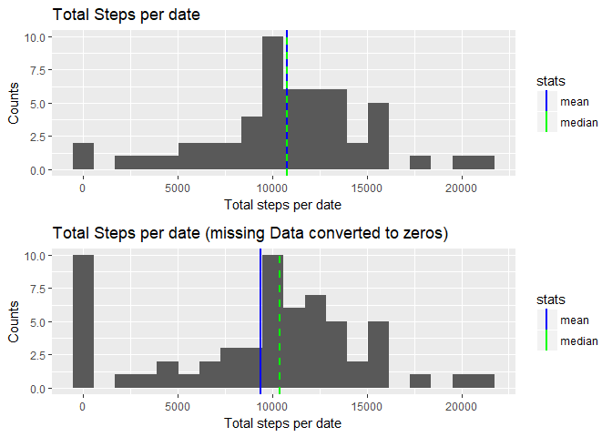
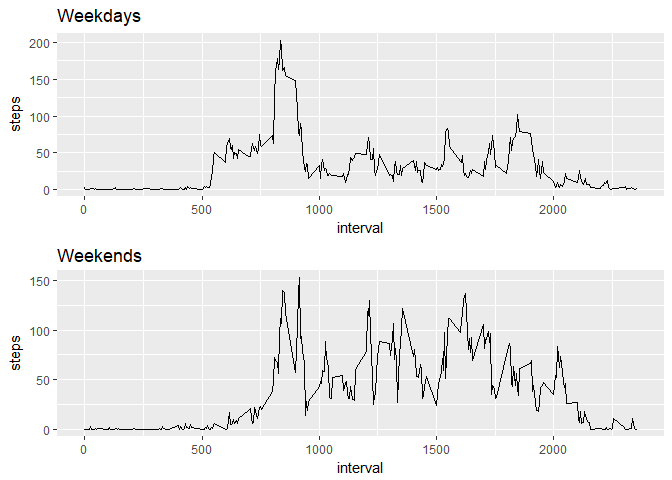

```r
# set figure output to images/ folder
knitr::opts_chunk$set(
  fig.path = "images/"
)
```

## Loading and preprocessing the data


```r
unzip("activity.zip")
data <- read.csv("activity.csv", sep=',', encoding = 'utf-8')
```

## What is mean total number of steps taken per day?


```r
library(ggplot2)
bydate <- aggregate(steps ~ date, data, FUN=sum, na.rm=TRUE)
meansteps <- mean(bydate$steps)
mediansteps <-median(bydate$steps)
```


```r
p1 <- ggplot(data = bydate, aes(bydate$steps)) + 
    geom_histogram(bins=20) +
    geom_vline(aes(xintercept=mean(bydate$steps), color="mean"), size=1) +
    geom_vline(aes(xintercept=median(bydate$steps), color="median"), size=1,
               linetype="dashed") +
    labs(title = "Total Steps per date", x="Total steps per date", y="Counts")+
    scale_color_manual(name="stats", values=c(mean="blue", median="green"))
print(p1)
```

<!-- -->

The mean of the total number of steps taken per day 
is 10766.19.  
The median of the total number of steps taken per day 
is 10765.  


## What is the average daily activity pattern?


```r
byinterval <- aggregate(steps ~ interval, data, FUN=mean, na.rm=TRUE)
maxpoint <- byinterval[byinterval$steps==max(byinterval$steps),]

p2 <- ggplot(data=byinterval, aes(x=interval, y=steps)) + geom_line() +
    geom_point() +
    geom_point(x=maxpoint$interval, y=maxpoint$steps, color="red", size=2) +
    labs(title="Average steps per 5-minute interval", x="5-minute interval", 
         y="Average number of steps")
print(p2)
```

<!-- -->

The 5-minute interval containing the maximum number of steps is 
835. 


## Imputing missing values


The number of missing values is 2304.  

The strategy to use to fill the missing values is to replace the NA with 0.


```r
library(grid)
library(gridExtra)
data2 <- data
data2$steps[is.na(data2$steps)] <- 0
bydate2 <- aggregate(steps ~ date, data2, FUN=sum, na.rm=TRUE)
meansteps2 <- mean(bydate2$steps)
mediansteps2 <-median(bydate2$steps)

p3 <- ggplot(data = bydate2, aes(bydate2$steps)) + 
    geom_histogram(bins=20) +
    geom_vline(aes(xintercept=mean(bydate2$steps), color="mean"), size=1) +
    geom_vline(aes(xintercept=median(bydate2$steps), color="median"), size=1,
               linetype="dashed") +
    labs(title = "Total Steps per date (missing Data converted to zeros)", 
         x="Total steps per date", y="Counts") +
    scale_color_manual(name="stats", values=c(mean="blue", median="green"))


grid.arrange(p1, p3)
```

<!-- -->

The impact on filling missing values with zeros is a decrease of the mean to
9354.23 and the median to 10395

## Are there differences in activity patterns between weekdays and weekends?


```r
library(timeDate)
data2$daytype <- factor(isWeekday(data2$date), 
                         levels=c(TRUE, FALSE), 
                         labels=c("weekday", "weekend"))
weekdaydata <- subset(data2, daytype=="weekday")
weekenddata <- subset(data2, daytype=="weekend")

weekdaygroup <- aggregate(steps ~ interval, weekdaydata, FUN=mean, na.rm=TRUE)
weekendgroup <- aggregate(steps ~ interval, weekenddata, FUN=mean, na.rm=TRUE)


p4 <- ggplot(data=weekdaygroup, aes(x=interval, y=steps)) + geom_line() +
    labs(title="Weekdays")

p5 <- ggplot(data=weekendgroup, aes(x=interval, y=steps)) + geom_line() +
    labs(title="Weekends")
grid.arrange(p4, p5)
```

<!-- -->

